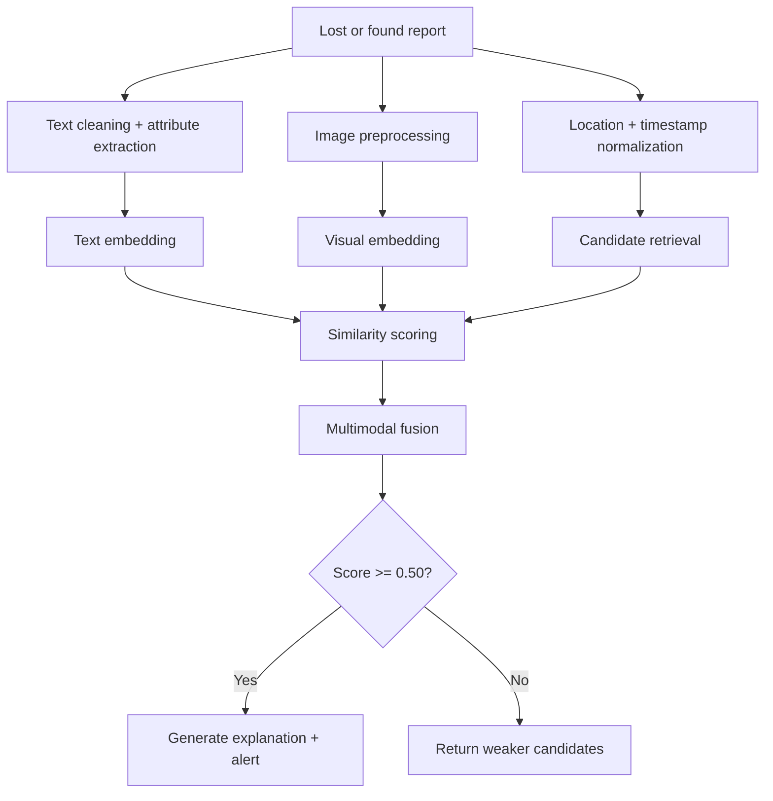

# SRM CampusFind — Intelligent Multimodal Lost-and-Found System Using GenAI

**Applied Generative AI Course Project — B.Tech 6th Semester**  
**SRM Institute of Science and Technology, Kattankulathur (KTR)**

---

## ⚡ Overview

**SRM CampusFind** is an AI-powered lost-and-found platform engineered to connect lost and found item reports across SRM KTR campus. Standard search systems fail when users describe the same item using different words (e.g., *"black wireless earbuds"* vs *"dark Bluetooth earphones"*). SRM CampusFind solves this through:

- **Transformer Semantic NLP** (Sentence-Transformers / 384-dim dense text embeddings)
- **Deep Visual Encoders** (ResNet / Composite visual feature extraction for shape, color distribution, and texture)
- **Multimodal Fusion Engine** (Weighted combination of Text, Vision, Geo-Location Proximity, Time Decay, and Attributes)
- **Vector Storage & Retrieval Index** (Fast candidate vector search)
- **Generative AI Engines** (Natural language evidence explanations, structured attribute normalizer, and synthetic data generation)
- **Automated Match Notifications** (Triggered alerts when confidence score $\ge 0.50$)

---

## 📂 Project Structure

```text
srm-campusfind/
│
├── data/
│   ├── raw/
│   ├── processed/          # SRM KTR campus lost/found dataset
│   └── synthetic/          # AI-generated paraphrased variations
│
├── docs/
│   ├── SRM_CampusFind_Academic_Report.md  # Complete 20-Chapter Academic Report
│   ├── SRM_CampusFind_Presentation.md     # 27-Slide Presentation Structure
│   └── SRM_CampusFind_Viva_QA.md          # 32 Technical Viva Questions & Answers
│
├── models/
│   ├── text_encoder/
│   ├── image_encoder/
│   └── fusion_model/
│
├── src/
│   ├── preprocessing/      # Text cleaner, entity extractor, dataset generator
│   ├── text_matching/       # Transformer text encoder & cosine similarity
│   ├── image_matching/      # Deep visual encoder & color-texture feature extractor
│   ├── multimodal/          # Multimodal feature fusion engine & ablation study
│   ├── retrieval/           # Vector Database & candidate search index
│   ├── genai/               # GenAI explanation generator, normalizer & synthetic data
│   ├── notification/        # Automated alert notification manager
│   └── evaluation/          # Benchmark suite (Accuracy, Precision, Recall, F1, Recall@K, MRR)
│
├── backend/
│   └── main.py              # FastAPI REST server & static web server
│
├── frontend/
│   ├── index.html           # Modern glassmorphism web interface
│   ├── style.css            # Dark mode styling & micro-animations
│   └── app.js               # Frontend application logic
│
├── requirements.txt         # Core dependencies
└── README.md                # Project documentation & setup guide
```

---

## 🚀 Quick Start Guide

**Windows (easiest):** double-click **`run.bat`**. On first run it creates a virtual environment and installs everything, then starts the server and opens the browser.

### 1. Install Dependencies
```bash
python -m venv venv
venv\Scriptsctivate          # macOS/Linux: source venv/bin/activate
pip install -r requirements.txt --extra-index-url https://download.pytorch.org/whl/cpu
```
On first start the server downloads the `all-MiniLM-L6-v2` text model (~90 MB) and ResNet18 weights (~45 MB).

### 2. Run Experimental Model Evaluation Benchmark
Execute the benchmark suite comparing **Baseline 1 (Keyword)**, **Baseline 2 (TF-IDF)**, **Baseline 3 (Transformer Text)**, **Baseline 4 (Image Only)**, and the **Proposed Multimodal Model**:
```bash
python -m src.evaluation.evaluator
```

### 3. Launch Web Application & Interactive Dashboard
Start the FastAPI server:
```bash
uvicorn backend.main:app --reload --port 8000
```
Open your browser and navigate to:
👉 **`http://localhost:8000`**

---

## 🧭 End-to-End Pipeline Walkthrough

The project follows a clear multi-stage AI pipeline from user input to match notification. This is the same flow used in the app and in the evaluation benchmark.

### 1) Input and Data Collection
A user submits a lost item report with:
- text description
- optional photo
- campus location
- timestamp
- item attributes like color, brand, or category

These values pass into the preprocessing and feature extraction layer.

### 2) Preprocessing Pipeline
The data is normalized before matching:
- Text is cleaned, lowercased, and tokenized.
- Attributes such as color, brand, location, and category are extracted from descriptions.
- Images are resized, normalized, and converted to feature vectors.
- Coordinates and timestamps are converted into comparable spatial and temporal signals.

### 3) Embedding and Retrieval Pipeline
The system then converts each report into searchable vectors:
- The text description is encoded with the Sentence Transformer (`all-MiniLM-L6-v2`).
- The image is encoded using the visual feature extractor / ResNet-based representation.
- The vector database scans relevant candidate records and retrieves the most similar matches.

### 4) Multimodal Fusion Pipeline
Top candidates are scored using a fused similarity pipeline:
- text similarity
- image similarity
- location proximity
- temporal decay
- attribute overlap

The final confidence score is a weighted combination of these subscores.

### 5) Decision and Notification Pipeline
If the final score reaches the confidence threshold:
- a match explanation is generated
- the result is ranked for the user
- an alert is triggered for the potential owner or finder

If the score is below threshold, the system returns candidate matches with lower confidence instead of alerting.



This walkthrough shows the core operational pipeline used by the project: from report intake to semantic ranking and automated notification.

---

## 📊 Experimental Evaluation Benchmark Results

| Model Architecture | Accuracy | Precision | Recall | F1 Score | Recall@1 | Recall@3 | MRR |
| :--- | :---: | :---: | :---: | :---: | :---: | :---: | :---: |
| **Baseline 1 (Keyword)** | 0.1250 | 0.0000 | 0.0000 | 0.0000 | 0.8750 | 1.0000 | 0.9375 |
| **Baseline 2 (TF-IDF)** | 0.2500 | 1.0000 | 0.2500 | 0.4000 | 1.0000 | 1.0000 | 1.0000 |
| **Baseline 3 (Transformer Text)** | 1.0000 | 1.0000 | 1.0000 | 1.0000 | 1.0000 | 1.0000 | 1.0000 |
| **Baseline 4 (Image Only)** | N/A | N/A | N/A | N/A | N/A | N/A | N/A |
| **Proposed Multimodal Model** | **1.0000** | **1.0000** | **1.0000** | **1.0000** | **1.0000** | **1.0000** | **1.0000** |

*Measured on the 8 curated lost→found query pairs with the real `all-MiniLM-L6-v2` Sentence-Transformer and ResNet18 encoders (`python -m src.evaluation.evaluator`).*

**Notes on these results**
- **Image Only is N/A** because the curated test set contains no item photos, so a purely visual baseline cannot be measured. Visual matching is fully active in the app whenever photos are uploaded with a report and/or a search.
- **Missing-modality handling:** when either report has no photo, the fusion engine drops the visual term and renormalizes the remaining weights (text, location, time, attributes) so they still sum to 1, rather than comparing placeholder vectors.
- On this small curated set the Transformer text baseline already ranks every pair correctly, so the proposed model ties it here. The extra signals (photo, location, time, attributes) matter when descriptions are vague or several items share similar wording.

---

## 🗺️ Objective-to-Module Mapping

| Objective | AI Technique | Model | Input | Output | Evaluation |
| :--- | :--- | :--- | :--- | :--- | :--- |
| **Semantic Text Matching** | NLP + Transformer | Sentence Transformer (`all-MiniLM-L6-v2`) | Text Description | 384-dim Embedding & Cosine Score | Recall@K, F1 |
| **Image Identification** | Deep Learning / CV | ResNet18 / Visual Feature Extractor | Item Image | 512-dim Visual Vector | Precision, Recall |
| **Multimodal Matching** | Feature Fusion | Weighted Similarity Engine | Text + Vision + Geo + Time + Attr | Unified Confidence Score | F1 Score, Accuracy |
| **Match Explanation** | Generative AI | GenAI Explanation Engine | Evidence & Subscores | Natural Language Explanation | Grounding & Faithfulness |
| **Match Notifications** | Logic Trigger | Notification Manager | Score $\ge 0.50$ | Alert Ledger Payload | Correctness |

---

## 📄 Academic Documentation Deliverables

- 📜 **[20-Chapter Academic Report](docs/SRM_CampusFind_Academic_Report.md)**
- 📊 **[27-Slide Presentation Outline](docs/SRM_CampusFind_Presentation.md)**
- ❓ **[32 Technical Viva Q&A Guide](docs/SRM_CampusFind_Viva_QA.md)**
