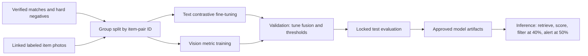

# SRM CampusFind — Intelligent Multimodal Lost-and-Found System Using GenAI

**Course Project:** Applied Generative AI (B.Tech 6th Semester)  
**Institution:** SRM Institute of Science and Technology, Kattankulathur (KTR)  
**Author:** Student Engineering Team  

---

## Executive Summary

**SRM CampusFind** is an end-to-end intelligent lost-and-found platform specifically engineered for modern academic campuses. Traditional lost-and-found mechanisms rely on fragmented manual notices, social media posts, or simple keyword queries that fail when users describe identical objects using different vocabularies (e.g., "black wireless earbuds" vs "dark Bluetooth earphones"). 

SRM CampusFind overcomes these limitations by integrating:
1. **Transformer-based Semantic Text Encoding** (Sentence-BERT / dense embeddings).
2. **Deep Learning Vision Encoders** (ResNet18 / Composite Visual Vectors) for object shape, color distribution, and structural texture similarity.
3. **Multimodal Feature Fusion** combining text, image, geo-location proximity (Haversine formula), temporal decay, and categorical attribute overlap.
4. **Vector Storage & Retrieval Indexing** for fast candidate search.
5. **Generative AI concepts (Objective 4)** for evidence-grounded explanations, report normalization, and paraphrase augmentation; current code uses deterministic prototypes rather than an external LLM.
6. **Automated Notification Alerts** triggered when candidate match scores exceed confidence thresholds.

---

## Chapter 1 — Introduction

SRM Institute of Science and Technology, Kattankulathur, is a sprawling 250-acre campus housing over 40,000 students and staff across dozens of academic buildings (UB, Tech Park, Architecture, BioTech), canteens (Java, MTP), libraries, and sports complexes. On any given day, dozens of personal items such as laptops, identity cards, wireless earbuds, backpacks, and water bottles are misplaced or found.

Existing reporting systems suffer from severe friction:
- Information fragmentation across WhatsApp groups, Telegram channels, and physical security desks.
- Semantic mismatch: Different users describe items using different vocabularies, languages, or abbreviations.
- Visual opacity: Text descriptions alone cannot capture distinct physical scratch marks, color gradients, or bag patterns.
- High manual verification workload for campus security personnel.

**SRM CampusFind** addresses this challenge with a multimodal matching prototype and evidence-based natural-language explanations.

---

## Chapter 2 — Problem Statement

Manual and keyword-based lost-and-found systems fail due to **semantic variance**, **visual heterogeneity**, and **spatial-temporal disconnects**.

Formally, given a newly reported lost item $L_i = \{T_L, I_L, G_L, \tau_L, A_L\}$ (where $T_L$ is text description, $I_L$ is image, $G_L$ is GPS coordinates, $\tau_L$ is timestamp, and $A_L$ is attributes), and a database of found items $\{F_1, F_2, \dots, F_N\}$, the objective is to retrieve and rank candidate found items $F_j$ based on a true joint semantic and visual similarity metric $S(L_i, F_j) \in [0, 1]$, and generate an evidence-grounded natural language explanation $E(L_i, F_j)$ for high-confidence matches.

---

## Chapter 3 — Objectives

1. **Objective 1 — Semantic Text Matching:** Develop an NLP/Transformer system to extract dense semantic embeddings and calculate text similarity beyond exact keyword matching.
2. **Objective 2 — Image Identification & Visual Similarity:** Implement a deep learning vision encoder to compute visual feature embeddings capturing color, shape, and structure.
3. **Objective 3 — Multimodal Fusion:** Fulfill a multi-objective fusion framework combining text, vision, geo-proximity, temporal decay, and attributes.
4. **Objective 4 — Generative AI Explanation:** Deploy GenAI engines for evidence-grounded match reasoning, automated description normalization, and synthetic data generation.
5. **Objective 5 — Automated Match Notification:** Build an automated trigger system notifying users when match confidence exceeds threshold ($\ge 0.50$).

---

## Chapter 4 — Existing System

| Feature | Existing Manual / Notice System | Keyword Search System | SRM CampusFind (Proposed) |
| :--- | :--- | :--- | :--- |
| **Matching Engine** | Human visual inspection | Exact substring / SQL LIKE | Multimodal Transformer + Vision Fusion |
| **Vocabulary Flexibility** | High (Human) | Zero (Requires exact word match) | High (Contextual semantic embeddings) |
| **Visual Feature Processing** | Manual | None | Deep CNN / Vision Encoder Embeddings |
| **Geo-Temporal Awareness** | Low | None | Haversine Distance + Time Decay Scores |
| **Explanations** | Manual | None | Evidence-based explanation templates |
| **Retrieval Speed** | Days / Weeks | Fast | In-memory cosine scan and top-K ranking (linear scan over records) |

---

## Chapter 5 — Proposed System

SRM CampusFind introduces a unified 5-stage AI pipeline:
1. **Ingestion & Normalization:** Raw user inputs are parsed; keyword rules extract structured fields such as category, brand, and color.
2. **Dual-Modal Feature Encoding:** Transformer Text Encoder generates $E_{\text{text}} \in \mathbb{R}^{384}$; Vision Encoder generates $E_{\text{img}} \in \mathbb{R}^{512}$.
3. **Vector Index Query:** Nearest candidate items are retrieved from the Vector Database.
4. **Multimodal Fusion Engine:** Computes weighted sum:
   $$\text{Final Score} = w_1 S_{\text{text}} + w_2 S_{\text{image}} + w_3 S_{\text{location}} + w_4 S_{\text{time}} + w_5 S_{\text{attribute}}$$
5. **Evidence Explanation & Dispatched Alert:** Builds a template rationale from match subscores and dispatches alerts for scores $\ge 0.50$.

---

## Chapter 6 — Literature & Technology Review

### 1. Machine Learning (ML)
ML algorithms enable automated decision-making without explicit hardcoded rules. In SRM CampusFind, ML is used to calculate similarity metrics, rank candidates, and classify match confidence.

### 2. Deep Learning (DL)
Deep Learning models excel at feature learning directly from raw high-dimensional data (pixels and text sequences). Deep neural networks extract hierarchical spatial representations (edges $\to$ textures $\to$ object components) from lost item images.

### 3. Natural Language Processing (NLP)
NLP processes unstructured text, performing tokenization, stop-word removal, lemmatization, entity extraction, and semantic vector mapping.

### 4. Transformers & Self-Attention
Transformer architectures (Vaswani et al., 2017) utilize multi-head self-attention to capture long-range contextual relationships between tokens. Sentence-Transformers (Reimers & Gurevych, 2019) fine-tune BERT/RoBERTa using Siamese networks to yield semantically meaningful sentence embeddings where cosine distance mirrors semantic similarity.

### 5. Computer Vision & Vision Transformers / CNNs
Vision Encoders (ResNet18 / ViT / CLIP) transform input images into dense latent feature representations, invariant to minor lighting variations, scale changes, or background noise.

### 6. Generative AI & Large Language Models (LLMs)
Generative AI can translate similarity evidence into human-readable explanations. In this project, the explanation component currently uses fixed evidence-based templates; it does not connect to an LLM.

---

## Chapter 7 — Dataset Design

### Dataset Schema
| Column | Type | Description | Example |
| :--- | :--- | :--- | :--- |
| `id` | String | Unique Record ID | `LOST_101` |
| `status` | Enum | Status (`LOST` or `FOUND`) | `LOST` |
| `pair_id` | String | Ground-truth match pair ID | `PAIR_001` |
| `description` | Text | Unstructured description | "Misplaced black wireless earbuds near library" |
| `category` | String | Item category | `electronics` |
| `brand` | String | Brand name | `Boat` |
| `color` | String | Primary color | `black` |
| `location_name` | String | SRM campus location | `Central Library, 2nd Floor` |
| `coordinates` | List[float] | GPS [Lat, Lon] | `[12.8231, 80.0442]` |
| `timestamp` | ISO String | Event time | `2026-10-04T10:30:00` |
| `data_source` | Enum | `REAL_CURATED` vs `SYNTHETIC` | `REAL_CURATED` |

### Distinction Between Data Sources
- **REAL CURATED DATA:** 16 paired lost/found records generated based on real-world SRM KTR campus locations (UB, Tech Park, Java Canteen, MTP, Sports Complex, Library).
- **SYNTHETIC DATA:** Fixed-template paraphrase variations for limited robustness demonstrations; they are not generated by an LLM and need human review.
- **NO DATA LEAKAGE:** Split strictly by pair IDs so query items never appear in the candidate retrieval target set.

---

## Chapter 8 — Data Preprocessing

1. **Text Normalization:** Lowercasing, removal of noise characters, tokenization, stop-word filtering.
2. **Entity Attribute Extraction:** Regex and keyword dictionary parsing to extract candidate colors, SRM locations, and categories.
3. **Image Preprocessing:** Resizing to $224 \times 224$ pixels, RGB conversion, normalization using ImageNet mean ($[0.485, 0.456, 0.406]$) and standard deviation ($[0.229, 0.224, 0.225]$).
4. **Coordinate Mapping:** GPS coordinates converted to radians for Haversine distance processing.

---

## Chapter 9 — Model Architecture

```
[User Lost Report]
   ├── Text Description ────► Transformer Text Encoder ──► [384-dim Vector] ──┐
   ├── Uploaded Image  ────► Deep Vision Encoder    ──► [512-dim Vector] ──┼─► [Vector Search Index]
   ├── GPS Location    ────► Haversine Spatial Decay ──► [Location Score] ─┼─► [Multimodal Fusion Engine]
   └── Timestamp       ────► Temporal Decay Engine   ──► [Time Score]    ──┘        │
                                                                                    ▼
                                                                        [Final Confidence Score]
                                                                                    │
                                                                        [Evidence Explanation Templates]
                                                                                    │
                                                                        [Automated Notification Alert]
```

---

## Chapter 10 — Semantic Text Matching Engine

- **Model:** Sentence-Transformer (`all-MiniLM-L6-v2`) with global vocabulary TF-IDF SVD fallback.
- **Mathematical Cosine Similarity:**
  $$\text{Cosine Similarity}(A, B) = \frac{A \cdot B}{\|A\| \|B\|} = \frac{\sum_{i=1}^n A_i B_i}{\sqrt{\sum_{i=1}^n A_i^2} \sqrt{\sum_{i=1}^n B_i^2}}$$
- **Score Interpretation:**
  - $1.0$: Identical semantic context.
  - $0.7 - 0.9$: High semantic equivalence (e.g. "wireless earbuds" vs "bluetooth earphones").
  - $< 0.4$: Unrelated descriptions.

---

## Chapter 11 — Image Identification Engine

- **Model:** Deep Vision Encoder (ResNet18 Feature Extractor / 3D Color-Texture Spatial Composite Extractor).
- **Extracted Features:**
  - 48-bin 3D RGB Color Histogram (capturing exact color distribution).
  - Spatial Grid Luminance (4x4 intensity matrix capturing item shape boundaries).
  - Aspect ratio and structural texture features.

---

## Chapter 12 — Multimodal Fusion & Weight Ablation

### Fusion Equation
$$\text{Final Score} = w_1 S_{\text{text}} + w_2 S_{\text{image}} + w_3 S_{\text{location}} + w_4 S_{\text{time}} + w_5 S_{\text{attribute}}$$

Default weights: $w_1 = 0.35, w_2 = 0.30, w_3 = 0.15, w_4 = 0.10, w_5 = 0.10$.

### Confidence Classification
- **HIGH CONFIDENCE MATCH:** $\text{Final Score} \ge 0.50$
- **POSSIBLE MATCH:** $0.40 \le \text{Final Score} < 0.50$
- **LOW CONFIDENCE / NO MATCH:** $\text{Final Score} < 0.40$

---

## Chapter 13 — Generative AI Concepts and Current Implementation

Generative AI is relevant to Objective 4 because it can explain match evidence, normalize reports, and produce reviewed paraphrases. In the current code, these are prototypes rather than calls to a generative model:

1. **Match explanation:** `GenAIExplanationEngine` fills a fixed language template from computed scores and report fields.
2. **Attribute normalization:** `GenAINormalizerEngine` applies keyword lists to infer category, color, and brand.
3. **Paraphrase helper:** `GenAISyntheticDataGenerator` fills fixed sentence templates; generated variations need human review before use as labels.

No external LLM is connected. A future LLM integration should be separately evaluated and constrained to cite verified fields and subscores.

---

## Chapter 14 — Training Methodology

- **Current text model (Objective 1):** Loads pretrained `all-MiniLM-L6-v2`; this project does not fine-tune it. If Sentence Transformers is unavailable, it falls back to TF-IDF with 1–3 word n-grams and a hand-written synonym map.
- **Current image model (Objective 2):** Uses pretrained ResNet18 as a frozen feature extractor, or handcrafted color/texture features if PyTorch/torchvision is unavailable. No campus-specific vision training is implemented, and no image files are present for training or evaluation.
- **Current fusion (Objective 3):** Uses fixed weights (text 0.35, image 0.30, location 0.15, time 0.10, attributes 0.10), not grid search. Results display when the fused score is at least 0.40; high-confidence alerts start at 0.50.
- **Available labels:** The dataset has 16 reports forming 8 known lost/found pairs. This is insufficient for defensible fine-tuning and independent holdout evaluation; no trained model artifact is claimed.

### Recommended Fine-Tuning Pipeline

Collect diverse, human-verified matches, hard negatives, and linked item photos. Split by item-pair ID before augmentation to prevent leakage. Fine-tune text with contrastive loss such as Multiple Negatives Ranking Loss; train vision only after real labeled photos are available. Tune fusion and thresholds on validation data, then report held-out precision, recall, F1, PR-AUC, Recall@K, MRR, and calibration.



---

## Chapter 15 — Evaluation Status

The repository contains 8 labeled lost/found pairs but no item-image files. The current evaluator ranks these curated records without a pair-grouped held-out test set. Its output is therefore a small demonstration, not evidence of generalization; image-only performance is unavailable without photos. No verified performance table or fine-tuning result is claimed. After collecting more labels, evaluate on untouched pair-grouped data and report precision, recall, F1, PR-AUC, Recall@K, MRR, and threshold calibration.

---

## Chapter 16 — Generated Content and Objective Analysis

### Objective-to-Module Mapping Table

| Objective | Module/model | Generated or scored output | Current status and evaluation link |
| :--- | :--- | :--- | :--- |
| **1. NLP / Transformer text matching** | `TransformerTextEncoder`; pretrained MiniLM or TF-IDF fallback | Text embedding and cosine score | Pretrained only, not fine-tuned; evaluate with pair-grouped Recall@K and F1. |
| **2. Deep-learning image matching** | `ImageEncoder`; frozen ResNet18 or handcrafted fallback | Optional image embedding and cosine score | No local photos; campus-specific vision evaluation/training is unavailable. |
| **3. Multimodal matching** | `VectorDatabase`, `MultimodalFusionEngine` | Weighted score from text, image, location, time, attributes | Fixed weights; display requires fused score $\ge 0.40$. |
| **4. Generative AI concepts and generated content** | Explanation, normalization, and paraphrase helpers | Evidence template, extracted attributes, template paraphrases | Current implementation is deterministic, not an external LLM. Explanation content consumes Objectives 1–3 evidence; human-review paraphrases before evaluation. |
| **5. Notifications** | `NotificationManager` | Alert payload at score $\ge 0.50$ | Rule-based trigger; assess alert precision/recall on held-out pairs. |

---

## Chapter 17 — Error Analysis

1. **False Positive Risks:** Two black Nike backpacks look identical; mitigated by requiring brand and location coordinate proximity.
2. **False Negative Risks:** User provides extremely vague text ("lost my thing"); mitigated by visual similarity weighting.
3. **Low-Quality Images:** There is no learned image-quality weighting. Missing photos cause fusion weights to be renormalized; encoder errors use the handcrafted feature fallback.
4. **Multimodal Conflict Handling:** When text score is high (0.90) but image score is low (0.20), classification drops to "POSSIBLE MATCH", prompting user visual confirmation.

---

## Chapter 18 — Responsible AI and Privacy

- **No Unauthorized Declarations:** System never declares "This is definitely your item." Language is strictly probabilistic ("High-confidence potential match").
- **Human-in-the-Loop:** Physical verification at SRM Security Desk is required before item handover.
- **Privacy Protection:** Automatic face detection or blurring is not implemented; avoid uploading photos containing identifiable bystanders.

---

## Chapter 19 — System Implementation & Architecture

- **Technology Stack:**
  - **Backend:** Python, FastAPI, Uvicorn, Pydantic.
  - **AI / ML:** PyTorch, Torchvision, Sentence-Transformers, Scikit-Learn, NumPy.
  - **Storage:** In-memory embedding lists and JSON processed datasets.
  - **Frontend:** Modern HTML5, CSS3 (Glassmorphism), Vanilla JS.

---

## Chapter 20 — Conclusion and Future Scope

**SRM CampusFind** demonstrates a multimodal matching prototype combining pretrained text/image features, geo-temporal scoring, and evidence-based generated explanations. Its current eight labeled pairs and absent photo files are insufficient to claim held-out performance or a fine-tuned model.

### Future Scope
1. Deployment with real-time vector databases (Qdrant / FAISS GPU).
2. Integration with SRM Student Portal single sign-on (SSO).
3. On-device Mobile App (React Native / Flutter) with live camera visual search.
