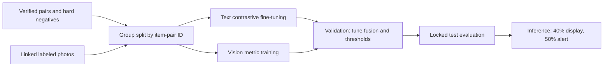

# SRM CampusFind — Academic Presentation Slides (27 Slides)

**Course Project:** Applied Generative AI (B.Tech 6th Semester)  
**Title:** SRM CampusFind — Intelligent Multimodal Lost-and-Found System Using GenAI  

---

### Slide 1: Title Slide
- **Title:** SRM CampusFind — Intelligent Multimodal Lost-and-Found System Using GenAI
- **Subtitle:** Connecting Lost & Found Reports via Semantic NLP, Computer Vision, Geo-Temporal Fusion, and Generative AI
- **Presenter:** B.Tech Computer Science & Engineering (6th Semester)
- **Institution:** SRM Institute of Science and Technology, Kattankulathur (KTR)

---

### Slide 2: Problem Statement
- **Campus Friction:** 40,000+ students and staff misplaced belongings daily across a 250-acre campus.
- **Fragmented Reporting:** Notices spread across WhatsApp groups, social media, and security posts.
- **Vocabulary Mismatch:** "Black wireless earbuds" vs "Dark Bluetooth earphones" fail under standard keyword search.

---

### Slide 3: Motivation
- **Automated Intelligence:** Eliminate manual notice scrolling for security and students.
- **Multimodal Synergy:** Combine text context, image structure, physical location, and event timestamps.
- **Explainable AI:** Build trust through natural language evidence explanations rather than black-box scores.

---

### Slide 4: Existing Systems & Limitations
- Manual paper logs / WhatsApp messages: High friction, low searchability.
- Traditional SQL/Keyword search: Zero semantic flexibility, fails on synonyms or typos.
- Pixel-only visual comparison: Fails under lighting shifts and image compression.

---

### Slide 5: Proposed System Overview
- Centralized web platform backed by a 5-component AI engine:
  1. GenAI Structured Normalizer
  2. Transformer Semantic Text Encoder
  3. Deep Vision Feature Encoder
  4. Multimodal Fusion Engine
  5. GenAI Explanation & Automated Alert System

---

### Slide 6: Primary Project Objectives
- **Obj 1:** Semantic Text Matching via Transformers & Cosine Similarity.
- **Obj 2:** Visual Feature Extraction & Similarity via Vision Encoders.
- **Obj 3:** Multimodal Weight Fusion (Text + Image + Geo + Time + Attributes).
- **Obj 4:** GenAI Evidence-Grounded Match Explanations.
- **Obj 5:** Automated Notification Alert Triggering.

---

### Slide 7: Why Machine Learning?
- **Current implementation:** Uses pretrained text/image representations; ranking and match labels use fixed similarity and fusion rules, not a trained match classifier.
- **Fine-tuning opportunity:** Learn from verified matches and hard negatives after collecting enough labeled data.

---

### Slide 8: Why Deep Learning?
- **Current implementation:** Frozen pretrained ResNet18 features, with a handcrafted color/texture fallback.
- **Training status:** No campus-specific image fine-tuning; no item-photo files are present for training or evaluation.

---

### Slide 9: Why NLP?
- **Text Processing:** Cleans, normalizes, and extracts structured entities (brand, color, location) from informal descriptions.

---

### Slide 10: Why Transformers & Self-Attention?
- **Contextual Embeddings:** Captures semantic meaning across sentence tokens via self-attention mechanisms.
- **Sentence-BERT:** Maps text into a continuous 384-dim embedding space where distance equals semantic difference.

---

### Slide 11: Why Generative AI?
- **Objective 4 concept:** Generative AI can explain match evidence, normalize reports, and produce reviewed paraphrases.
- **Current prototype:** Explanations and normalization use deterministic templates/keyword rules; no external LLM is connected.
- **Paraphrases:** Fixed templates provide limited variations; review them before using them as labels.

---

### Slide 12: Dataset Design & Schema
- **Curated Dataset:** 16 reports forming 8 known lost/found pairs.
- **Synthetic Paraphrases:** Fixed-template variations exist for only some examples.
- **Image Data:** No photo files are present; image-only evaluation is unavailable.
- **No Data Leakage:** Strict separation between lost queries and found candidate sets.

---

### Slide 13: Data Preprocessing Pipeline
- Text cleaning $\to$ Lowercasing $\to$ Entity parsing.
- Image resizing ($224\times224$) $\to$ ImageNet normalization.
- Coordinates $\to$ Haversine distance computation.

---

### Slide 14: Objective 1 — Semantic Text Matching
- Sentence-Transformer (`all-MiniLM-L6-v2`) dense vector encoding.
- Formula: $\text{Cosine Similarity} = \frac{A \cdot B}{\|A\| \|B\|}$.
- Intended to improve paraphrase matching; comparative held-out performance has not yet been established.

---

### Slide 15: Objective 2 — Image Identification & Visual Similarity
- ResNet18 Feature Extractor / 3D RGB Color-Spatial Composite Extractor.
- Extracts 512-dim visual embeddings capturing color, shape, and structural texture.

---

### Slide 16: Objective 3 — Multimodal Fusion Engine
- Formula: $\text{Final Score} = w_1 S_{\text{text}} + w_2 S_{\text{image}} + w_3 S_{\text{location}} + w_4 S_{\text{time}} + w_5 S_{\text{attribute}}$
- Thresholds:
  - $\ge 0.50$: High Confidence Match
  - $0.40 - 0.49$: Possible Match
  - $< 0.40$: Low Confidence / No Match

---

### Slide 17: Model Architecture Diagram
- Text/image encoders $\to$ top-5 retrieval $\to$ weighted fusion $\to$ 40% display gate $\to$ evidence-template explanation; notification at 50%.

---

### Slide 18: System Architecture & Tech Stack
- **Backend:** FastAPI, Python, PyTorch, Scikit-Learn.
- **Retrieval:** In-memory text/image embedding lists with cosine scoring and top-5 shortlist.
- **Frontend:** Glassmorphism Web App (HTML5, Vanilla JS, CSS3).

---

### Slide 19: Training & Fine-Tuning Strategy
- **Implemented:** Pretrained `all-MiniLM-L6-v2` and frozen ResNet18 feature extraction; fixed fusion weights. No fine-tuning or grid search is implemented.
- **Available data:** 8 labeled pairs and no photo files; insufficient for a defensible fine-tune or independent test.
- **Planned:** Collect verified positives, hard negatives, and linked photos; split by item-pair ID; fine-tune text with contrastive loss and vision after obtaining labeled photos; tune on validation and evaluate on a locked test set.

---

### Slide 20: Evaluation Metrics
- **Classification:** Accuracy, Precision, Recall, F1-Score.
- **Retrieval/Ranking:** Recall@1, Recall@3, Mean Reciprocal Rank (MRR).

---

### Slide 21: Evaluation Status
- The corpus has 8 labeled pairs and no photos; the evaluator has no pair-grouped held-out test.
- Do not present the previous perfect-score table as validated generalization performance.
- After collecting more labels, report held-out precision, recall, F1, PR-AUC, Recall@K, MRR, and threshold calibration.

---

### Slide 22: Generated Content & Analysis
- **Objective 4 / explanation:** Template text uses Objectives 1–3 scores and report evidence.
- **Objective 4 / normalization:** Keyword rules extract category, color, and brand.
- **Objective 4 / paraphrases:** Fixed templates create variations; review them before using as training labels.

---

### Slide 23: Objective-to-Module Mapping
| Objective | Module | Current implementation |
| :--- | :--- | :--- |
| 1. Text matching | `TransformerTextEncoder` | Pretrained MiniLM or TF-IDF fallback; not fine-tuned. |
| 2. Image matching | `ImageEncoder` | Frozen ResNet18 or handcrafted fallback; no local photos for evaluation. |
| 3. Fusion | `VectorDatabase`, `MultimodalFusionEngine` | Weighted ranking; display requires fused confidence of at least 40%. |
| 4. Generative AI concepts | Explanation/normalization/paraphrase helpers | Deterministic templates and keyword rules; no external LLM. |
| 5. Notifications | `NotificationManager` | Alert threshold is 50%. |

---

### Slide 24: Demo Scenario Walkthrough
1. Student inputs lost report: "Lost dark blue Nike backpack at Tech Park."
2. Found report exists: "Found navy Nike bag near Java Canteen."
3. The engine computes available modality scores; only results meeting the 40% display gate are shown.
4. An evidence template explains the measured scores.
5. An in-app alert is created at 50% fused confidence; a person verifies ownership.

---

### Slide 25: Error Analysis & Limitations
- **False Positives:** Identical generic items (e.g. black bottles) require location verification.
- **Image Failure:** Missing photos cause fusion-weight renormalization; encoder errors use handcrafted features. No learned image-quality weighting exists.
- **Conflict Resolution:** System flags conflicting text/image evidence as "Possible Match".

---

### Slide 26: Responsible AI & Privacy
- **Probabilistic Wording:** "High-confidence potential match" rather than absolute ownership claims.
- **Human Verification:** Physical verification at SRM Security Desk mandatory.
- **Privacy:** Face detection/blurring is not implemented; avoid uploading photos with identifiable bystanders.

---

### Slide 27: Conclusion & Q&A
- **Summary:** SRM CampusFind demonstrates a multimodal matching prototype; additional labeled pairs and photos are needed to validate generalization.
- **Questions & Discussion.**
